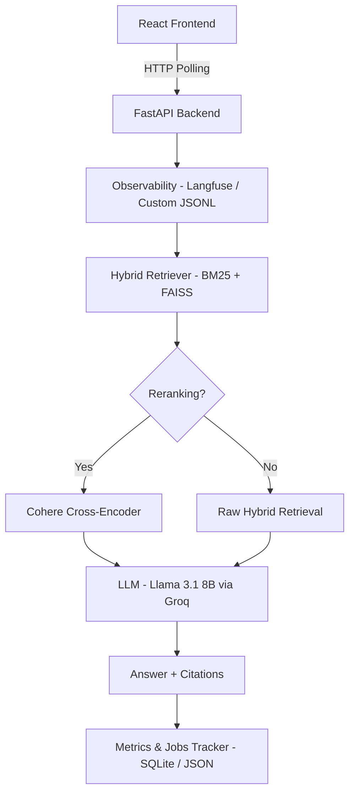

# 🚀 DocuMentor: Production-Grade RAG with Observability & Evaluation

DocuMentor is a state-of-the-art Retrieval-Augmented Generation (RAG) system engineered for transparency, performance, and automated evaluation. It features a complete pipeline with hybrid retrieval, cross-encoder reranking, and a robust background evaluation engine that measures key RAG metrics (Faithfulness, Relevancy, Precision) in real-time.

---

## 🏗️ Modern Architecture



---

## 🔥 Key Features

### 1. Dual-Core Observability
- **Real-Time Logs**: Custom JSONL-based observability stream that feeds the frontend logs panel instantly.
- **Long-Term Tracing**: (Optional) Langfuse integration for enterprise-grade trace analysis across retrieval and generation spans.

### 2. Persistent Background Evaluation
- **Job ID Tracking**: Each benchmark run generates a unique `job_id`. Progress is persisted to disk, allowing users to refresh the page or switch tabs without losing track of long-running evaluations.
- **RAGAS Benchmarking**: Automated calculation of **Faithfulness**, **Answer Relevancy**, and **Context Precision** using a defensive Groq-safe loop (`n=1`, exponential backoff).
- **Comparison Engine**: Automatically pits a "Baseline" (no reranking) against an "Improved" (reranking enabled) pipeline to quantify performance gains.

### 3. High-Fidelity React Dashboard
- **Live Progress Visualization**: Real-time progress bars and status messages (e.g., *"Executing Baseline..."*, *"Finalizing results..."*).
- **Metric Deltas**: Clear visual indicators of percentage improvements in RAG quality after applying reranking.
- **Clean Metrics**: Automated 4-decimal rounding for all dashboard cards and historical tables.

### 4. Advanced RAG Pipeline
- **Hybrid Search**: Combines keyword-based (BM25) and semantic (FAISS/Embeddings) retrieval.
- **Citations**: Native support for source-backed answers with clickable document references.
- **Reranking**: Integrated Cohere Rerank-v3 for precision filtering of retrieved contexts.

---

## 🚀 Getting Started

### 📋 Prerequisites
* **Python 3.11+**
* **Node.js & npm** (for the frontend)
* **Groq API Key** (LLM & Evaluation)
* **Cohere API Key** (Reranking)

### 🛠️ Installation

1. **Clone the Project:**
   ```bash
   git clone https://github.com/your-username/DocuMentor.git
   cd DocuMentor
   ```

2. **Backend Setup:**
   ```bash
   # Create and activate venv
   python -m venv .venv
   .\.venv\Scripts\activate   # Windows
   
   # Install dependencies
   pip install -r api/requirements.txt
   ```

3. **Frontend Setup:**
   ```bash
   cd frontend
   npm install
   ```

4. **Configuration:**
   Create/Update `config/keys.json`:
   ```json
   {
     "GROQ_API_KEY": "gsk_...",
     "COHERE_API_KEY": "..."
   }
   ```

---

## 🏃 Running the Application

### Method 1: Split Terminals (Recommended)

**Terminal 1 (Backend):**
```bash
uvicorn api.main:app --reload
```

**Terminal 2 (Frontend):**
```bash
cd frontend
npm start
```

### Method 2: Accessing the UI
Once both are running, open your browser to:
- **Dashboard**: `http://localhost:3000`
- **Interactive API Docs**: `http://localhost:8000/docs`

---

## 📂 Project Structure

```text
DocuMentor/
├── api/                # Core FastAPI implementation
│   ├── core/           # RAG logic (Retrieval, Reranking, Generation)
│   ├── routes/         # API endpoints (Query, Ingest, Monitoring)
│   └── services/       # Glue code for business logic
├── frontend/           # React SPA with Tailwind CSS & Framer Motion
├── evaluation/         # RAGAS benchmark engine & dataset generator
├── database/           # SQLite persistence layer
├── data/               # Persistent storage (DB, Vector Index, Jobs, Source Docs)
├── config/             # Environment & Key management
└── logs/               # Real-time observability streams
```

---

## 🛠️ Tech Stack

* **LLM**: Groq (Llama-3.1-8b-instant)
* **Frontend**: React, Tailwind CSS, Lucide, Framer Motion
* **Backend**: FastAPI, LangChain
* **Vector Store**: FAISS
* **Evaluation**: RAGAS & Custom Persistent Job Engine
* **Database**: SQLite (SQLAlchemy/Aiosqlite)

---

## 📜 License
MIT © DocuMentor Team
