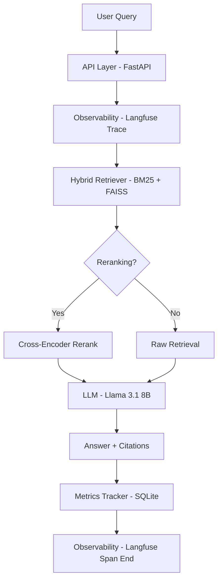

# 🚀 DocuMentor: Production-Grade RAG with Observability & Evaluation

DocuMentor is a production-level Retrieval-Augmented Generation (RAG) system with a focus on observability, performance tracking, and automated evaluation. It features a complete pipeline with hybrid retrieval, cross-encoder reranking, and a dynamic evaluation system that measures performance on every document ingestion.

---

## 🏗️ Architecture



---

## 🔥 Key Production Features

### 1. Full-Lifecycle Observability (Langfuse)
Integrated Langfuse tracing across the entire pipeline. Every step—retrieval, reranking, and generation—is captured as a trace with input/output, latency, and token usage, allowing for deep debugging and monitoring.

### 2. Metrics & Persistence (SQLite)
End-to-end metrics tracking:
* **Latency**: p50 and p95 tracking for every query.
* **Cost**: Estimated cost per query based on model usage.
* **Tokens**: Automated input/output token counting.
All metrics are persisted in a local **SQLite database** (`data/mentor.db`) for long-term trend analysis.

### 3. Fully Dynamic Evaluation System
No more hardcoded benchmarks. DocuMentor automatically generates a custom evaluation dataset for **every uploaded document**:
* **Dataset Generation**: Splits documents into chunks and uses LLM (temp=0) to generate factual and reasoning questions.
* **Automated Benchmarking**: Runs the RAG pipeline twice for every generated question:
  1. **Baseline**: Reranking DISABLED.
  2. **Improved**: Reranking ENABLED.
* **RAGAS Metrics**: Measures **Faithfulness**, **Answer Relevancy**, and **Context Precision** without "fake" scores.

### 4. CI/CD Regression Gating
GitHub Actions integration ensures that every pull request meets performance standards. If metrics (faithfulness or relevancy) drop by more than **5%** compared to the previous baseline, the build is automatically failed.

### 5. Production Dashboard
A built-in Streamlit dashboard provides a real-time view of:
* Aggregated system metrics (Avg Latency, Cost, Total Queries).
* Historical evaluation trends.
* Document ingestion status.

---

## 🚀 Getting Started

### 📋 Prerequisites
* Python 3.10+
* Groq API Key (LLM & Evaluation)
* Langfuse Public/Secret Keys (Observability)
* SQLite (Built-in)

### 🛠️ Installation

1. **Clone and Install:**
   ```bash
   git clone https://github.com/your-username/DocuMentor.git
   cd DocuMentor
   pip install -r api/requirements.txt
   pip install langfuse streamlit pandas datasets ragas watchdog
   ```

2. **Configuration:**
   Update `config/keys.json` with your credentials:
   ```json
   {
     "GROQ_API_KEY": "gsk_...",
     "LANGFUSE_PUBLIC_KEY": "pk-lf-...",
     "LANGFUSE_SECRET_KEY": "sk-lf-...",
     "LANGFUSE_HOST": "https://cloud.langfuse.com"
   }
   ```

3. **Initialize Database:**
   ```bash
   python -m database.db
   ```

4. **Launch Backend & Dashboard:**
   ```bash
   # Run Backend
   uvicorn api.main:app --host 127.0.0.1 --port 8000
   
   # Run Dashboard (New Terminal)
   streamlit run dashboard/app.py
   ```

---

## 📂 Project Structure

```text
DocuMentor/
├── api/                # FastAPI routes and middleware
├── evaluation/         # Dynamic dataset generation and RAGAS evaluator
├── observability/      # Langfuse tracing integration
├── metrics/            # Latency and cost tracking system
├── database/           # SQLite persistence layer
├── retrieval/          # Hybrid search implementation
├── reranking/          # Cross-encoder re-ranking logic
├── indexing/           # Document embedding and indexing
├── ingestion/          # File parsing and chunking
└── dashboard/          # Streamlit performance dashboard
```

---

## 🛠️ Tech Stack

* **LLM**: Groq (Llama-3.1-8b-instant)
* **Observability**: Langfuse
* **Evaluation**: RAGAS & Custom Dynamic Generator
* **Database**: SQLite
* **Reranker**: Cohere or HuggingFace (MiniLM)
* **Visualization**: Streamlit
* **CI/CD**: GitHub Actions

